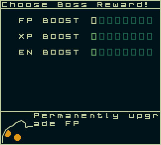
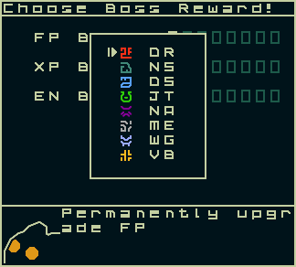

# BOSS VICTORY MENU

After winning a Boss Battle, after assigning FP Rewards, but before Level Ups and Evolutions, this Menu has you select an upgrade for each living DGMN.

Here are the possible upgrades:
  - Permanently increase 1 FP
  - Permanently increase EN
  - Permanently increase XP
    -  This XP is added when gaining a Level
  - Reduce the penalty from using a higher-stage Attack

The choices you have available are dependent on the Boss Battle beaten. The higher the Floor of the Boss, the higher right on the grid you can go. When defeating the Floor 5 boss, you will only be allowed to select from the first column of upgrades.

Each Boss Battle of a specific floor will always give the upgrade for their column. If you beat the Floor 5 Boss, and select the FP upgrade, and then re-challenge the Tower, and beat the Floor 5 Boss again, you will be allowed to select the XP or EN upgrades. When a DGMN has earned all possible upgrades for a specific Floor, the Boss Victory Menu will be skipped automatically.

Each upgrade can only be obtained once per DGMN. You must obtain the first column upgrade before you can select the next column. For example, winning the Floor 10 Boss Battle while you do not have the first XP upgrade will only let you select the first XP upgrade. If you re-win the Floor 10 Boss Battle afterwards, the second XP upgrade will then be selectable.

Other Documentation that might be helpful:
  - Bosses
  - DGMN Growth Menu

## SCREENSHOTS

---

## CLASS INFO

### EXTENDS
[ListMenu](#boss-victory-menu) -> [Menu](#boss-victory-menu)

### PARAMETERS 

| NAME | TYPE | DESCRIPTION |
| --------- | ---- | ----------- |
| currFloor | Number | Dungeon's Current Floor |

---

## METHODS

### INITIALIZE
`init()`

Sets up the Menu's initial state

### CLEAR INFO TEXT
`clearInfoText()`

Clears the Bottom Info Bar area

### DRAW LIST
`drawList()`

Draws the "List" of Icons for the Reward Grid

*This overrides the standard `drawList` from **ListMenu***

### DRAW MENU
`drawMenu()`

Draws the Menu to the screen

*This overrides the standard `drawMenu` from **ListMenu***

### DRAW FP MENU
`drawFPMenu()`

Draws the Popup Menu for FP

### DRAW ICON
`drawIcon(row,col,image)`

Draws a small, rectangular icon used to show the Upgrade and its unlocked levels

| NAME | TYPE | DESCRIPTION |
| --------- | ---- | ----------- |
| row | number | Y Position |
| col | number | X Position |
| image | string | Name of the Image used for the Icon |

### LAUNCH FP SELECTION
`launchFPSelection()`

Sets the FP Menu to open so the Menu draws the Popup Menu

### PREVIOUS CHOICE
`prevChoice()`

Handles the action for Up on the D-Pad. Used for both the main Menu, as well as the FP Menu

### NEXT CHOICE
`nextChoice()`

Handles the action for Down on the D-Pad. Used for both the main Menu, as well as the FP Menu

### SELECT CHOICE
`selectChoice(message,onDone)`

Handles the action for the A Button. Used for both the main Menu, as well as the FP Menu

| NAME | TYPE | DESCRIPTION |
| --------- | ---- | ----------- |
| onDone | function | Callback for when the message is done writing |

### DRAW DGMN PORTRAIT
`drawDgmnPortrait(portraitImg)`

Draws the Portrait of the Currently Shown DGMN

| NAME | TYPE | DESCRIPTION |
| --------- | ---- | ----------- |
| portraitImg | Image | Fetched Image of the DGMN's Portrait |
